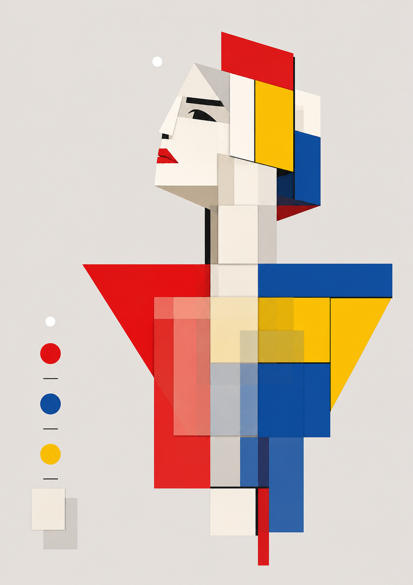
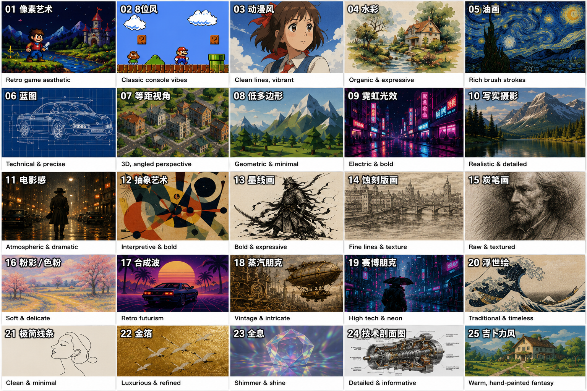
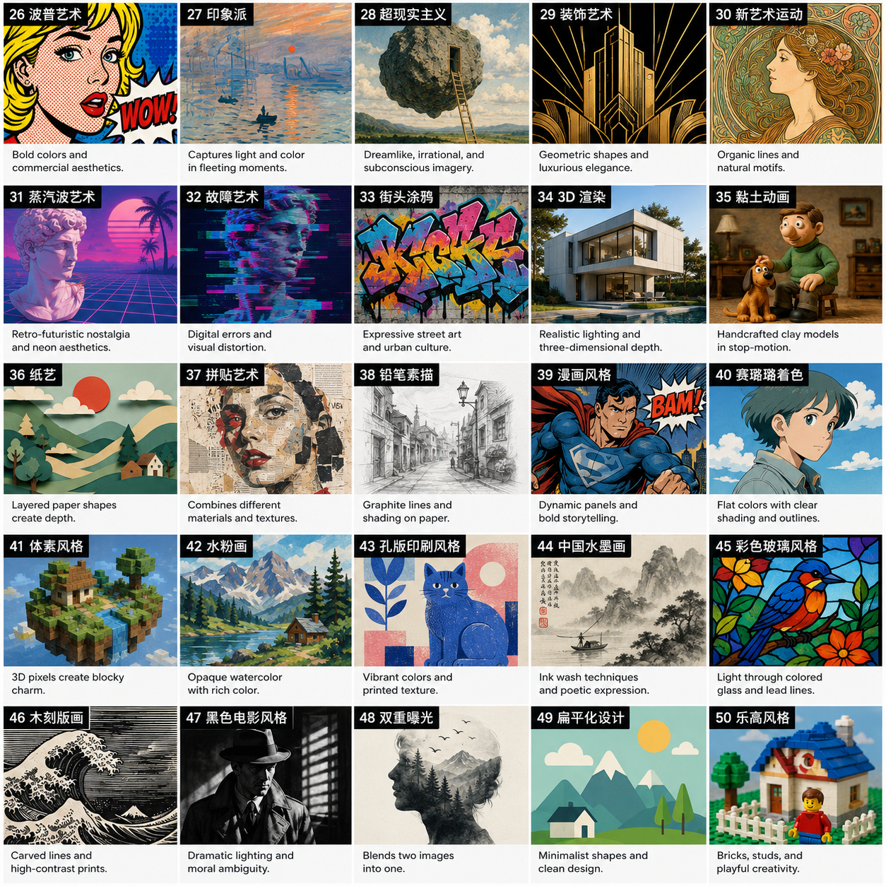

<p align="center">
  
</p>

<h1 align="center">Muse-image.skill</h1>

<p align="center">
  <i>「把模糊灵感蒸馏成结构化视觉方案」</i>
</p>

<p align="center">
  
  
  
  
</p>

<br>

<p align="center">
  <b>AI 扮演专业艺术家，把你的半句脑洞扩成完整画面方案，逐段带你审阅——每段还给你备选方向激发灵感。</b>
</p>

<br>

<p align="center">
  <a href="#效果展示">看效果</a> ·
  <a href="#安装">安装</a> ·
  <a href="#它能做什么">它能做什么</a> ·
  <a href="#工作原理">工作原理</a>
</p>

---

## 效果展示

输入一句话，AI 艺术家写出完整画面方案，逐段过审：

```
用户: 现代艺术风格的缪斯女神，体现灵感与艺术

AI:   【1. 主体细节】
      缪斯女神完全由蒙德里安式几何色块构成——头部是乳白长方形
      与淡灰三角拼接，双肩展开成不对称的红黄蓝矩形平面……
      
      备选：A. "纯几何重构" / B. "水墨与金属融合"
      → 用户选 A，AI 重写

      【2. 画面构图】……（逐段继续）

      → 全部确认 → 输出 .prompt.md → 出图或保存
```

输出文件可直接用于 Midjourney、Stable Diffusion、ComfyUI、即梦、文心一格等平台。

<p align="center">
  
  
</p>

---

## 安装

```bash
# 克隆仓库到 Claude Code 技能目录
git clone https://github.com/rison114514/Muse-image.git ~/.claude/skills/muse-image

# （可选）配置 API 密钥以支持直接出图
cd ~/.claude/skills/muse-image
python3 setup.py
```

在 Claude Code 中输入 `/muse-image` 即可启动。

不配 API 也能用全部 prompt 生成功能——最后选「只要 prompt」，复制到任意文生图平台出图。

---

## 它能做什么

* **艺术家扩写** — AI 以专业艺术家身份，一次性写出 4–7 段高密度画面描述（主体/外貌/姿态/构图/色彩/光影），每段 60–180 字
* **诱导型备选方向** — 每段过审时额外提供 2 个差异化替代方案（换氛围、换视角、换文化语境），没灵感时直接选
* **50 种风格库** — 4 大类（写实摄影 / 插画手绘 / 数字复古 / 传统工艺），支持复合混搭如 `25+18` 吉卜力 × 蒸汽朋克
* **三级负面抑制** — L1 默认全局 + L2 风格反义 + L3 AI 动态推导 + L4 用户自定义，自动叠加去重
* **双模式输出** — 直连 API 出图，或导出 `.prompt.md` 文件给 Midjourney / SD / 即梦等平台
* **参考图读图** — 贴本地路径，AI 读取图像并提取色调、构图、质感等视觉特征拼入 prompt
* **对话式微调** — 对任何段落说"把咖啡杯换成抹茶碗"，AI 精准重写该段，保持其余不变

---

## 工作原理

```
1. 你说一句话
       ↓
2. AI 艺术家内部写完完整画面方案（4–7 段）
       ↓
3. 逐段展示 + 每段 2 个备选方向 → 你对每段接受/换方向/自定义修改
       ↓
4. 三级抑制自动叠加（默认 + 风格反义 + AI 动态推导）
       ↓
5. 写入 .prompt.md 文件
       ↓
6. 选择：出图（调 API）/ 只要 prompt（复制到其他平台）
```

不再有问卷填表、不再有状态机持久化——AI 先出方案，你做主编。

---

## 风格速查

| 大类 | ID | 代表风格 |
|---|---|---|
| 📷 写实/电影 | 10 / 11 / 47 / 48 | 写实摄影 · 电影感 · 黑色电影 · 双重曝光 |
| 🎨 插画/手绘 | 03 / 04 / 25 / 39 | 动漫风 · 水彩 · 吉卜力 · 美漫 |
| 🕹 数字/复古 | 01 / 19 / 17 / 34 | 像素艺术 · 赛博朋克 · 合成波 · 3D 渲染 |
| 🖼 传统/工艺 | 05 / 44 / 27 / 21 | 油画 · 中国水墨 · 印象派 · 极简线条 |

完整 50 种 + 使用方式见 `gen_assets.py --help`。支持复合混搭和自由文本描述。

---

## 文件布局

```
~/.claude/skills/muse-image/
├── SKILL.md                    # 技能定义
├── README.md                   # 本文件
├── setup.py                    # API 配置向导
├── assets/                     # 展示素材
├── scripts/
│   ├── gen_assets.py           # 图像生成器（50 风格 + API）
│   ├── brief_to_prompt.py      # Prompt 合成器（独立可用）
│   └── session.py              # Session 管理（兼容旧版）
└── reference/
    ├── style-categories.md     # 风格分类参考
    └── suppression.md          # 三级抑制规则
```

运行时产物：

```
prompts/
├── <run_id>.prompt.md          # 每次生成的 prompt
└── latest.prompt.md            # 快捷入口（指向最新）

outputs/
└── <run_id>.png                # 对应图像
```

---

## Other Languages

[English](./README.md) · 中文

---

## License

MIT
